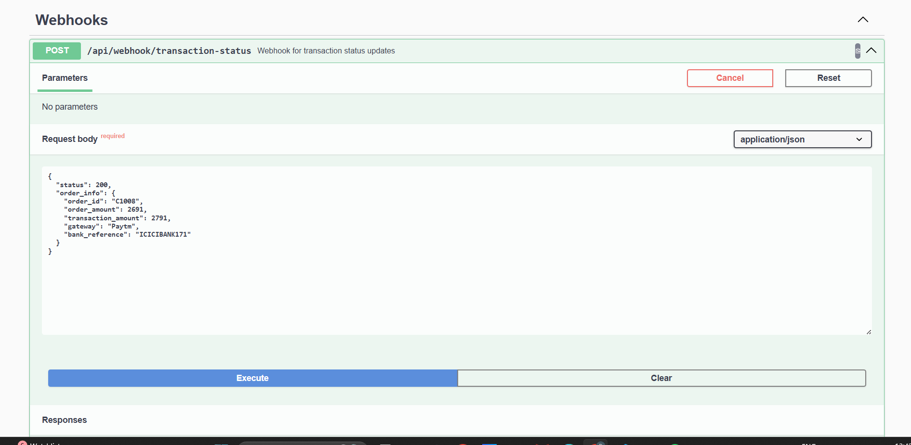
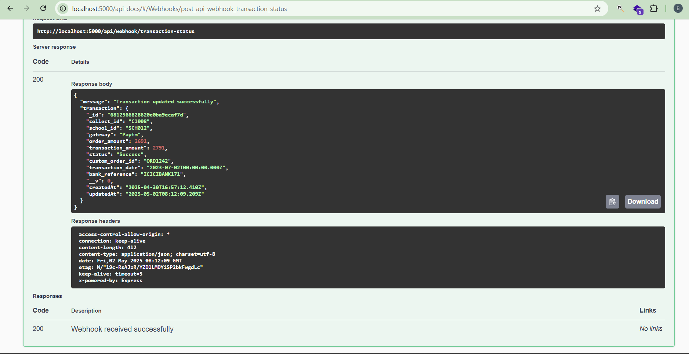

# School Payments & Dashboard API

## Swagger Screenshots

### Swagger API's


### Webhook API


### Webhook API Response



This repository contains the backend API's for the School Payments & Dashboard application, built with Node.js, Express, and MongoDB.

## 🔧 Tech Stack

- **Node.js** - JavaScript runtime
- **Express.js** - Web framework
- **MongoDB** - NoSQL database
- **Mongoose** - MongoDB ODM
- **Swagger/OpenAPI** - API documentation
- **CSV Parser** - For importing data from CSV files
- **dotenv** - Environment variable management

## 📋 Features

- RESTful API endpoints for managing school transactions
- MongoDB integration with Mongoose models
- Data import functionality from CSV/Excel files
- Comprehensive API documentation using Swagger UI
- Webhook handling for transaction status updates
- Pagination and filtering capabilities
- Environment variable configuration

## 🚀 Getting Started

### Prerequisites

- Node.js (v14 or higher)
- MongoDB (MongoDB Atlas)
- npm

### Installation

1. Clone the repository

   ```bash
   git clone `https://github.com/kantamanenibharathsai/schoolPayBackendAssignment.git`
   cd school-payments-backend
   ```

2. Install dependencies

   ```bash
   npm install
   ```

3. Create a `.env` file in the root directory with the following variables:

   ```
   PORT=5000
   MONGODB_URI=mongodb://localhost:27017/school-payments
   NODE_ENV=development
   ```

4. Import sample data

   ```bash
   npm run import-data
   ```

5. Start the development server
   ```bash
   npm run dev
   ```

The server will be running at `http://localhost:5000`

### Environment Variables

| Variable    | Description               | Default                                   |
| ----------- | ------------------------- | ----------------------------------------- |
| PORT        | Port to run the server on | 5000                                      |
| MONGODB_URI | MongoDB connection string | mongodb://localhost:27017/school-payments |
| NODE_ENV    | Application environment   | development                               |

## 📁 Project Structure

````
school-payments-backend/
├── controllers/          # Request handlers
│   ├── importController.js
│   └── transactionController.js
├── data/                 # Data files (CSV/Excel)
├── dbconfig/             # Database configuration
│   └── db.js             # MongoDB connection
├── models/               # Mongoose models
│   ├── student.js
│   └── transaction.js
├── node_modules/         # Node.js dependencies
├── routes/               # API routes
│   ├── importRoutes.js
│   └── transactionRoutes.js
├── services/             # Business logic
│   └── transactionService.js
├── swagger/              # API documentation
│   └── swagger.js
├── utils/                # Helper functions
│   ├── csvParser.js
│   └── errorHandler.js
├── app.js                # Express application setup
├── config.env            # Environment variables
├── package-lock.json
├── package.json
├── README.md
└── server.js             # Server entry point

## 🔄 API Endpoints

### Transactions

| Method | Endpoint                                          | Description                            |
| ------ | ------------------------------------------------- | -------------------------------------- |
| GET    | `/api/transactions`                               | Get all transactions with pagination, start_dae, end_date|
| GET    | `/api/transactions/school/:school_id`             | Get transactions for a specific school, start_date, end_date |
| GET    | `/api/transactions/check-status/:custom_order_id` | Check transaction status               |
| POST   | `/api/transactions/manual-update`                 | Manually update transaction status     |

### Webhooks

| Method | Endpoint                          | Description                           |
| ------ | --------------------------------- | ------------------------------------- |
| POST   | `/api/webhook/transaction-status` | Update transaction status via webhook |

## 📚 API Documentation

API documentation is available through Swagger UI at `/api-docs` when the server is running.

Student Model
javascript{
  student_id: String,  // required, unique
  name: String,        // required
  school_id: String,   // required
  class: String,       // required
  email: String,       // required
  phone: String,       // required
  address: String,
  createdAt: Date,     // automatically added by timestamps
  updatedAt: Date      // automatically added by timestamps
}
Transaction Model
javascript{
  collect_id: String,      // required, unique
  school_id: String,       // required
  gateway: String,
  order_amount: Number,
  transaction_amount: Number,
  status: String,          // enum: ['Success', 'Pending', 'Failed'], default: 'Pending'
  custom_order_id: String, // required, unique
  transaction_date: Date,  // default: Date.now
  bank_reference: String,
  createdAt: Date,         // automatically added by timestamps
  updatedAt: Date          // automatically added by timestamps
}

## 📄 Data Import

The application includes functionality to import data from CSV files:

Place your students.csv and transactions.csv files in the data directory
Access the import endpoint or use the import controller functionality:
POST /api/import/students
POST /api/import/transactions

The application uses the csvParser utility to parse the CSV files and populate the MongoDB database with the data.

## 🧪 Testing

Run tests using:

```bash
npm test

```

## 🚀 Deployment

The API is deployed at: [https://school-payments-api.example.com](https://school-payments-api.example.com)

## 📝 License

This project is licensed under the MIT License - see the LICENSE file for details.

## 👥 Contributors

- Your Name - `https://github.com/kantamanenibharathsai?tab=repositories`
````
